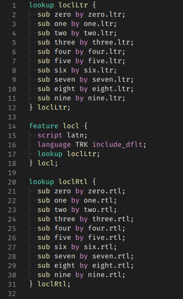

# VSCODE-AFDKO: Opentype feature file support

This package adds support for [OpenType feature files](https://adobe-type-tools.github.io/afdko/OpenTypeFeatureFileSpecification.html) in the Adobe "[AFDKO](https://github.com/adobe-type-tools/afdko)" format to VS Code.

## Screenshot

(Screenshot From Amiri font)

## Thanks

The syntax highlighting patterns for AFDKO is based on the [opentype-feature-bundle](https://github.com/kennethormandy/opentype-feature-bundle) for Atom Editor by Kennet Ormandy  which is based upon [Brook Elgie’s original Textmate bundle](https://github.com/brew/opentype-feature-bundle).

## License

[The MIT License (MIT)](LICENSE.md)

Copyright © 2007–2015 [Brook Elgie](http://brookelgie.com) 
Copyright © 2014–2016 [Kenneth Ormandy](http://kennethormandy.com) 
Copyright © 2020 [Santhosh Thottingal](https://thottinga.in)